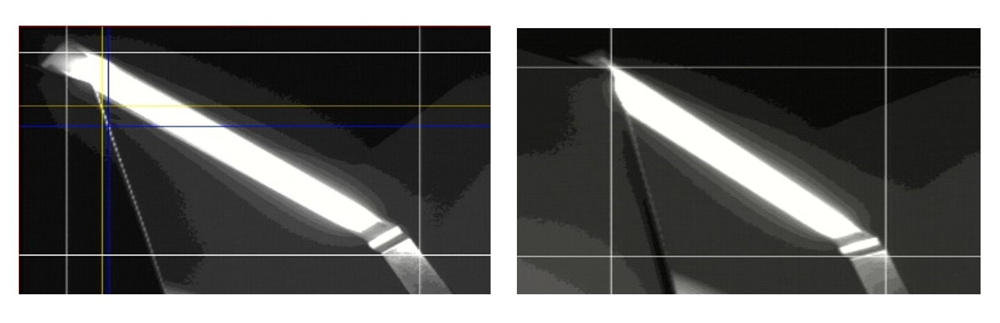

# Video-Processing-with-FPGA
Real-time video processing with DE10 development board. Part of second year BalanceBug project

### Tasks:
- color masking
- RGB to HSV conversion
- Interface with microprocessor using I2C

White detection and edge detection results:

Color masking result:

Effect of adding Gaussian filter to remove noise:

